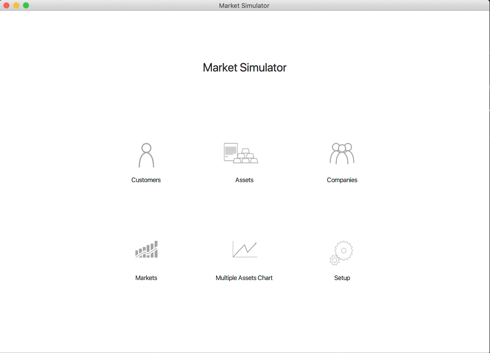
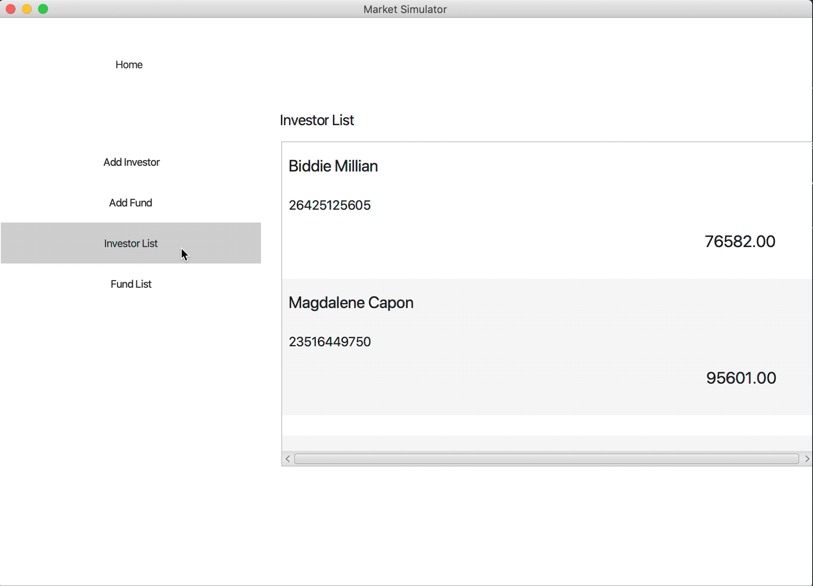
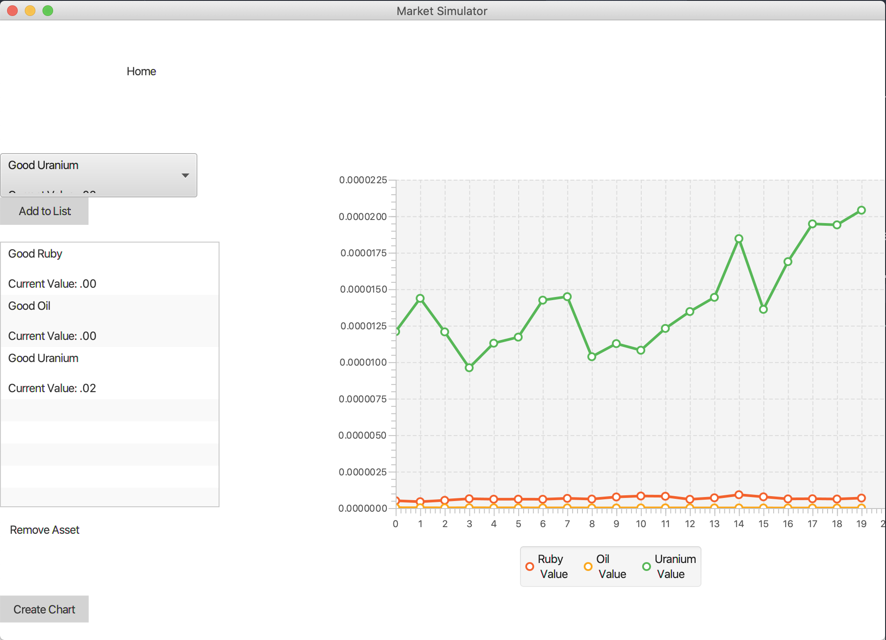
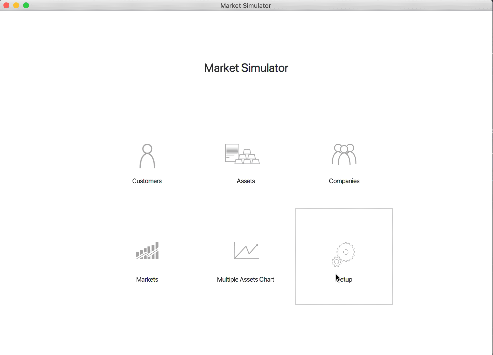

# Market Simulator
## Overview
Market simulator is a simple JavaFX application that mimics a real stock exchange. The application uses multithreading to provide truly independent work of the investors!
It allows you to create...



...and delete assets, markets, companies and investors.



You can obseve historical values of the market goods and compare them.



There is also a serialization system that allows you to save the state of the simulator.



## Running the project
To build and run the project just use proper maven command: ```mvn compile javafx:run```
